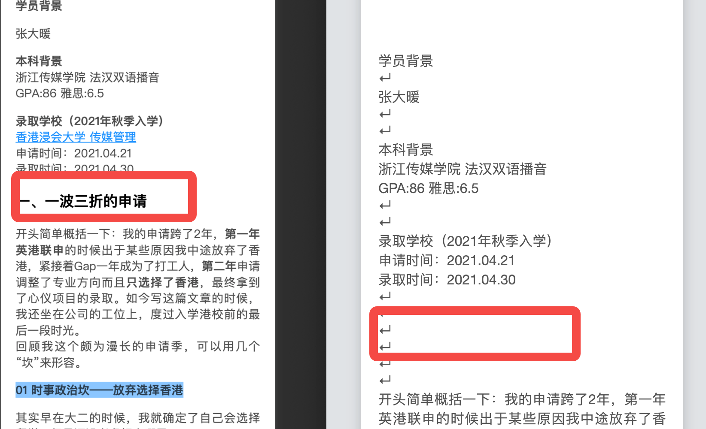

# taro 文本嵌套太多层以后,百度小程序无法正确解析Text
下图效果

另外发现Text 嵌套以后,第三层以后的点击事件无法触发.

## Taro.createSelectorQuery().in(this) 方法在组件中失效,并且没有提供函数组件的使用方法
报错信息如下

An SelectorQuery call is ignored because no proper page or component is found. Please considering using `SelectorQuery.in` to specify a proper one.


## 富文本解析嵌套太多,百度小程序还是无法解析

dangerouslySetInnerHTML方法中的富文本的层级太多还是会丢失文本.
```jsx
        <View
          className='taro_html'
          dangerouslySetInnerHTML={{ __html: RichText }}
        ></View>
```

